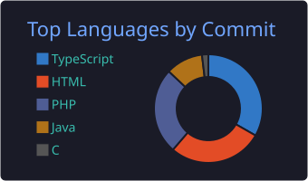

Hi, I'm Yeray Garrido Parra 👋

**Software Engineer | Full Stack Developer | Backend Specialist (Java/PHP) | Linux Enthusiast**

🇪🇸 **Haz clic para ver en Español**

### Sobre mí

Soy un Ingeniero de Software enfocado en la arquitectura Backend y la optimización extrema (WPO). Huyo de las soluciones *Low-Code* y las plantillas prefabricadas; mi prioridad es construir sistemas escalables, rápidos y seguros desde cero. Actualmente compagino mi trabajo como desarrollador con el Grado Superior en Desarrollo de Aplicaciones Web (Zornotza FP, Modalidad Dual).

*   **Experiencia Real:** Ingeniero de Software desarrollando módulos core para sistemas ERP corporativos (arquitecturas PHP multi-tenant, enrutamiento propio, persistencia de datos). 
*   **Mentalidad de Ingeniería:** Forjado en la metodología de 42 Urduliz (C, algoritmos, gestión de memoria). Acostumbrado a operar y desarrollar 100% en entornos Linux.
*   **Enfoque Full Stack:** Desde motores matemáticos puros y conexiones Java (JNI, Virtual Threads, Swing/JavaFX) hasta arquitecturas SPA de alto rendimiento (React 19, Vite, Tailwind).
*   **Ecosistema Open Data:** Creador de plataformas cívicas en Euskadi consumiendo feeds en tiempo real (GTFS, SIRI-VM) cruzados con bases de datos locales (SQLite/MySQL).

---

🇬🇧 **Click to view in English**

### About Me

I am a Software Engineer focused on Backend architecture and extreme performance optimization (WPO). I avoid *Low-Code* solutions and pre-built templates; my priority is to build scalable, fast, and secure systems from scratch. I currently balance my work as a developer with a Higher Degree in Web Application Development (Dual VET at Zornotza FP).

*   **Real Experience:** Software Engineer developing core modules for corporate ERP systems (multi-tenant PHP architectures, custom routing, advanced data persistence).
*   **Engineering Mindset:** Forged in the 42 Urduliz methodology (C, algorithms, memory management). Accustomed to operating and developing 100% in Linux environments.
*   **Full Stack Approach:** From pure mathematical engines and Java connections (JNI, Virtual Threads, Swing/JavaFX) to high-performance SPA architectures (React 19, Vite, Tailwind).
*   **Open Data Ecosystem:** Creator of civic platforms in the Basque Country consuming real-time feeds (GTFS, SIRI-VM) merged with local databases (SQLite/MySQL).

---

### 🛠️ Tech Stack
<!-- Aquí mantienes tus iconos/badges actuales de C, Java, PHP, MySQL, React, Linux, etc. -->

---

### 💻 Featured Projects

| Project | Tech | Description |
| :--- | :--- | :--- |
| **BizkaiBus+ / Metro+** | PHP 8, SQLite, Vanilla JS, Leaflet | Two real-time transit PWAs served from one codebase. Built on live GTFS + SIRI open data with zero-load local DB architecture. |
| **archive.yeraygarrido.dev** | PHP, SQLite, GSAP, JS | Custom photo gallery platform. Mobile-first "reels" experience, high-res downloads, and a custom PHP backoffice. |
| **yeraygarrido.dev** | React 19, TypeScript, Vite | Custom SPA portfolio. Built from scratch, 100/100 Lighthouse scores, GSAP smooth scrolling (0ms TBT). |
| **java-scraper** | Java | Automated web scraper designed for data extraction, processing, and structuring from web pages. |
| **3_Erronka_T2_Txurdinaga** | Java, Swing | Desktop application built entirely in Java for automated sports league and tournament management. |
| **GastroAccess Euskadi** | React 19, TypeScript, Leaflet | Accessibility-first restaurant finder that scores venues using algorithms on official Basque open data. |
| **Zalbi Aisia** | PHP 8, WordPress (\_s), ACF | Full freelance project: custom native CMS architecture + CPTs + real-time filtering catalog. |

---

### 🎓 Academic & Certifications

*   **Software Engineer (VET Dual)** | CIFP Zornotza LHII (2024 - 2027)
*   **Cybersecurity & Ethical Hacking** | BIG School (2026)
*   **Programming Piscine & Core Curriculum (C, Linux)** | 42 Urduliz (2022 - 2023)
*   **Web Development Professional Certificate (Level 3)** | Fundación EDE *(Score: 9/10)* (2021 - 2022)

---

### 📊 GitHub Stats

  
  
    

  
  
    

  

---

Developed with ❤️ by <a href="https://yeraygarrido.dev">Yeray Garrido Parra</a>

