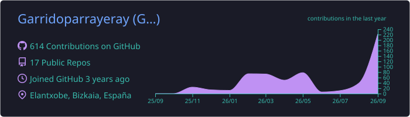

<h1 align="center">Hi, I'm Yeray Garrido Parra 👋</h1>
<h3 align="center">Web Developer (DAW) | Backend & Frontend | Linux Enthusiast</h3>

  
  
  
  

---

  
🇪🇸 <strong>Haz clic para ver en Español</strong>

  ### Sobre mí
  Soy una persona comprometida, versátil y con una actitud proactiva, en constante desarrollo personal y profesional. Actualmente curso el **Grado Superior en Desarrollo de Aplicaciones Web (Zornotza FP)**.

  * **Experiencia Real:** He trabajado administrando webs y desarrollando plugins en **WordPress/PHP** para organizaciones como Reciclanet y Glocalium.
  * **Formación:** Pasé por la piscina de **42 Urduliz** y completé el **primer año de desarrollo** (C, Bash, Linux). También tengo certificación de nivel 3 en Desarrollo Web.
  * **Entorno:** Realizo mi desarrollo completo en entorno **Linux**.
  * **Soft Skills:** Mi experiencia en gestión de eventos y atención al público me ha dado gran capacidad de resolución de problemas y trabajo bajo presión.

  
🇬🇧 <strong>Click to view in English</strong>

  ### About Me
  I am a committed, versatile, and proactive developer, constantly focused on personal and professional growth. I am currently studying for a **Higher Technician Degree in Web Application Development (Zornotza FP)**.

  * **Real Experience:** I have worked on web administration and **WordPress/PHP** plugin development for organizations like Reciclanet and Glocalium. I am always looking for new challenges.
  * **Education:** I completed the "Piscine" at **42 Urduliz** and finished the **first year of the core curriculum** (C, Bash, Linux). I also hold a Level 3 Professional Certificate in Web Development.
  * **Environment:** I perform all my development within a **Linux** environment.
  * **Soft Skills:** My background in event management and customer service has equipped me with strong problem-solving skills and the ability to work well under pressure.

---

### 🛠️ Tech Stack

  
  
  
  
  
  
  
  
  
  
  
  
  
  

---

### 💻 Featured Projects

| Project | Tech | Description |
| :--- | :--- | :--- |
| **[yeraygarrido.dev](https://yeraygarrido.dev)** | React 19, Vite, GSAP, Tailwind | Custom SPA portfolio. Built from scratch, near-perfect Lighthouse scores. |
| **[Zalbi Aisia](https://github.com/Garridoparrayeray/zalbi-web-server)** | PHP 8, WordPress (_s), ACF, JS | Full freelance project: custom theme + CPTs + real-time filtering catalog. |
| **[wp_custom_scripts](https://github.com/Garridoparrayeray/wp_custom_scripts)** | PHP, WordPress | Custom scripts for tailored software solutions (GNU license). |
| **[ZornotzaFPJAVA](https://github.com/Garridoparrayeray/zornotzaFPJAVA)** | Java | Optimized and refactored collection of FP exercises. |
| **[libft](https://github.com/Garridoparrayeray/libft)** | C, Makefile | My own library of standard C functions (42 Methodology). |

---

### 🎓 Academic Background

* **Web Application Development (DAW)** | *CIFP Zornotza LHII* (2024 - Present)
* **Programming Piscine & Core Curriculum (C, Linux, Algorithms)** | *42 Urduliz* (2022 - 2023)
* **Web Development Professional Certificate (Level 3)** | *Fundación EDE* (Score: 9/10) (2021 - 2022)

---

### 📊 GitHub Stats

  
  
    

  
  
    

  

---

Developed with ❤️ by <a href="https://yeraygarrido.dev">Yeray Garrido Parra</a>

